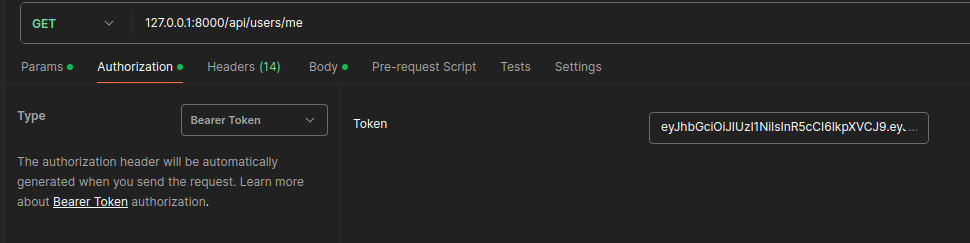

## Запуск проекта 
Docker version 27.1.1, build 6312585

если исп `docker-compose`, а не `docker comopse`, то надо отразить это в `Makefile:DOCKER_COMPOSE`
1. make help
2. make (по умл start -> migrate -> dump)
---

Без докера.

1. Запускаем postgresql локально и создаем в ней БД
2. В .env просовываем нужные креды для коннекта и т.д
3. Устанавливаем зависимости. Я использую poetry, но для удобства вывел requirements.txt
4. `alembic -c app/alembic.ini  upgrade head`
5. Исп. скрипт dump/user_dump.sql (см make dump)
6. `sanic app.server:create_app`
---
### Данные пользователей. 
После make dump/исп. user_dump. 

Будет созданно 2а пользователя.

| name       | email          | password   |
|------------|----------------|------------|
| `admin`    | `admin@mail.ru`|   `1234`   |
| `user`     | `user@mail.ru` |   `1234`   |

У user будет 1на модель Bill с 2мя Транзакциями.

## URL's
POST

`127.0.0.1:8000/api/auth/login`

body: `{
    "email": "user@mail.ru",
    "password": "1234"
}`

response: `{access_token: str, refresh_token: str}`
Используем access_token

---

POST

`127.0.0.1:8000/api/auth/refresh`

через N-минут, access_token истечет -> получаем access из refresh

body: `{
    "refresh_token": str
}`

response: `{access_token: str}`

---
GET/PUT/DELETE/POST - 
`127.0.0.1:8000/api/users`

PUT example: `{
    'user_ids': [<список id пользователей на изменение>],
    'email': str,
    'name': str,
}`

DELETE example: `{
    'user_ids': [<список id пользователей на удаение>],
}`

POST example: `{
    email: str,
    password: str,
    is_admin: bool = False,
    name: str,
}`

---

GET/PUT - Для всех

`127.0.0.1:8000/api/users/me`

---

POST - Webhook оплаты

`127.0.0.1:8000/api/wh/`

POST example: `{
  "transaction_id": str,
  "user_id": int,
  "account_id": int,
  "amount": float,
  "signature": str,
}`

Пытаемся получить модель счета связанную с account_id, 
если такой для user_id нет, создаем новую

---
GET - Получить инфорамция по счетам с транзакциями.
Для Админа все счета, для пользователя только его. 

`127.0.0.1:8000/api/wh/bills`

---
GET - Получить инфорамция по конкретному счету.
Админ может получить по любому, пользователь только по своему

`127.0.0.1:8000/api/wh/bills/<int>`

Docker version 27.1.1, build 6312585
